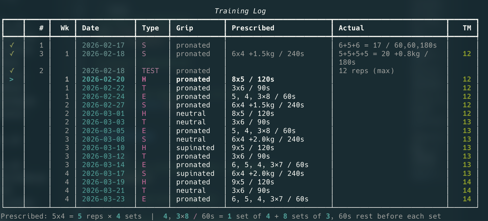
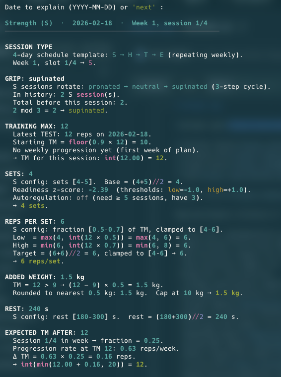

# cli-bar

Terminal interface for [bar-scheduler](https://github.com/bvpotapenko/bar-scheduler) -- an evidence-informed strength training planner for bodyweight exercises (Pull-Up, Dip, Bulgarian Split Squat).






## Install

```bash
uv tool install git+https://github.com/bvpotapenko/cli-bar.git
```

Or clone and run locally:

```bash
git clone https://github.com/bvpotapenko/cli-bar.git && cd cli-bar
uv sync
uv run cli-bar      # open interactive menu
```

## Quick start

```bash
cli-bar profile init --height-cm 180 --sex male --bodyweight-kg 80
cli-bar profile add-exercise pull_up --target-reps 20 --baseline-max 8
cli-bar plan
```

## Commands

| Command | Description |
|---------|-------------|
| `profile init` | Create / update profile (height, sex, bodyweight, days/week) |
| `profile add-exercise <id>` | Add an exercise and configure it interactively |
| `profile remove-exercise <id>` | Remove an exercise from your profile |
| `profile update-weight <kg>` | Update current bodyweight |
| `profile update-equipment` | Configure bands, machine assistance, or BSS elevation |
| `profile update-language <code>` | Save display language (en / ru / zh) |
| `plan` | Unified history + upcoming plan; `--weeks N`; `--json` |
| `refresh-plan` | Reset plan anchor to today after a break; `--json` |
| `log-session` | Log a completed session -- interactive or one-liner |
| `show-history` | Display session history; `--limit N`; `--json` |
| `plot-max` | ASCII chart of max reps; `-t z/g/m` trajectory overlays |
| `status` | Current training max, readiness, plateau/deload flags; `--json` |
| `volume` | Weekly rep volume chart; `--weeks N`; `--json` |
| `explain <DATE\|next>` | Step-by-step breakdown of how a session was planned |
| `1rm` | 1-rep max estimate (5 formulas, ★ recommendation) |
| `delete-record <N>` | Delete history entry by ID |
| `help-adaptation` | Adaptation timeline: what the planner can predict at each stage |

All data commands accept `--exercise / -e` (default: `pull_up`). Most accept `--json` for scripting.

## Interactive menu

Run `cli-bar` with no arguments:

```
[1] Show training log & plan
[2] Log today's session
[3] Show full history
[4] Progress chart
[5] Current status
[6] Update bodyweight
[7] Weekly volume chart
[e] Explain how a session was planned
[r] Estimate 1-rep max
[f] Reset plan to today (after a break)
[u] Update training equipment
[l] Change display language
[i] Setup / edit profile
[a] Add / reconfigure an exercise
[d] Delete a session by ID
[h] How the planner adapts over time
[0] Quit
```

## Multi-exercise & language

```bash
cli-bar -e dip            # open menu with dip pre-selected
cli-bar -e bss plan       # plan command for Bulgarian split squat
cli-bar --lang ru         # Russian UI for this session
cli-bar profile update-language zh   # save Chinese as default
```

## Documentation

- [CLI Examples](docs/cli_examples.md) -- commands, set formats, output samples
- [Features](docs/features.md) -- full command and flag reference

The training engine (adaptation logic, formulas, plan algorithm) is documented in the [bar-scheduler library](https://github.com/bvpotapenko/bar-scheduler).

## Contributing

This repo is the CLI frontend only. To contribute to the planning engine, see [bar-scheduler](https://github.com/bvpotapenko/bar-scheduler).

PRs and issues welcome on both repos.

## License

CC BY-NC 4.0 -- non-commercial use with attribution. See [LICENSE](LICENSE).

Author: Potapenko Bogdan    
*ML / AI Engineer @ Shenzhen, 2026*     
Telegram: https://t.me/roborice
